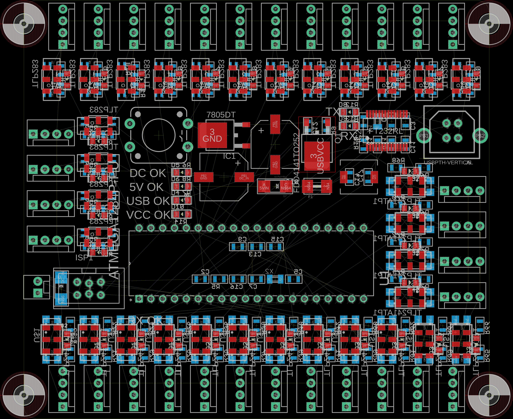

# industrial-microcontroller
A familiar platform designed for robust and unpredictable environments

I really like this project. I worked at a museum fabricator for a while, working on their electronic internals. I had an awesome time and I learned a lot about real-world applications and how to make a design that works perfectly on a lab bench work perfectly after being shipped around the world, plugged into the wrong power supply, kicked repeatedly and left in baking heat and 100% humidity.

Lots of isolation.

